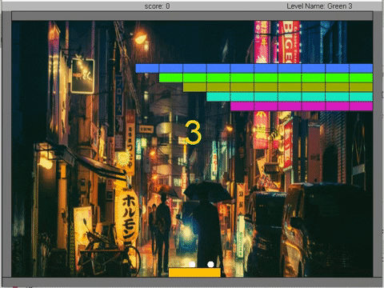
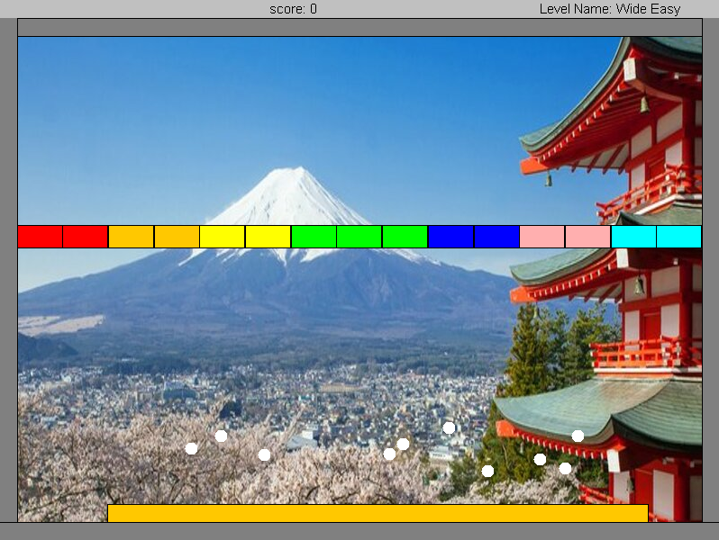
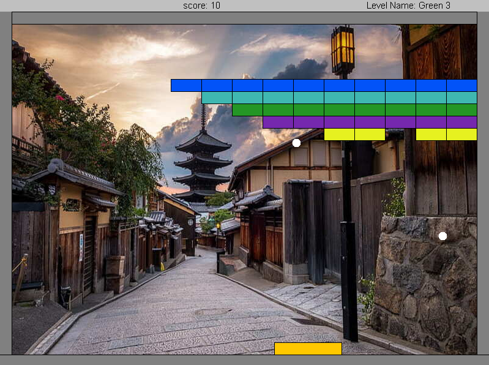
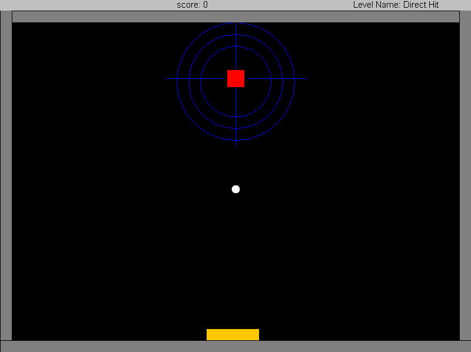
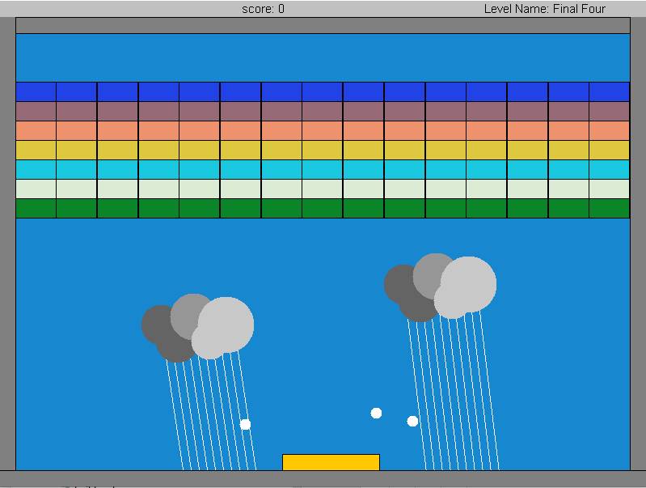
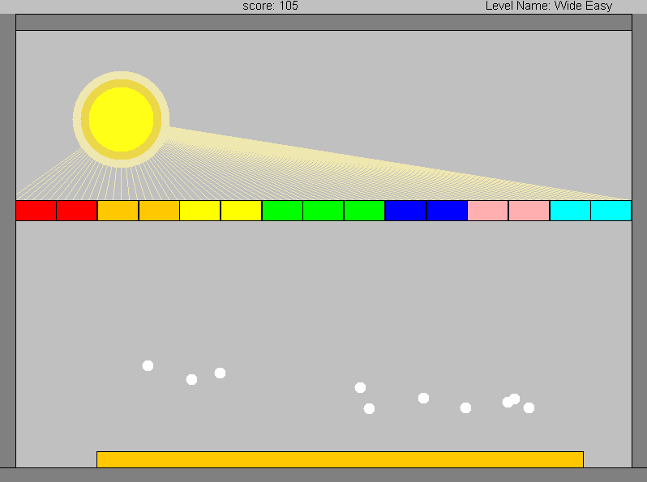
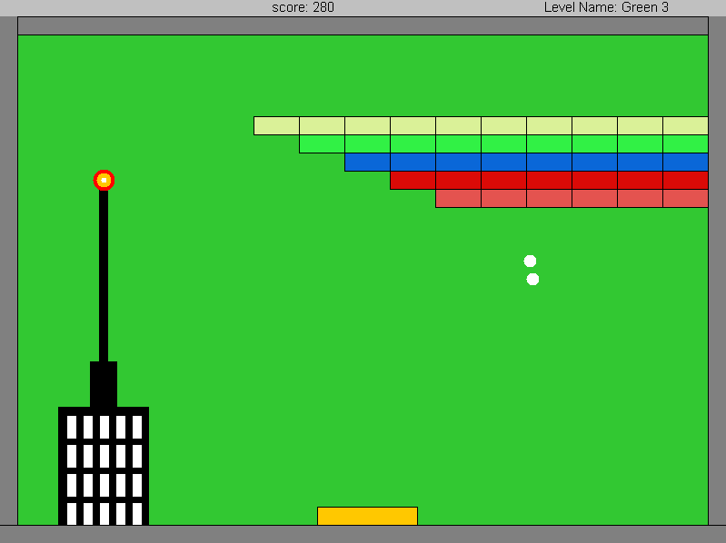

<h4 align="center">


</h4>

<h4 align="center">let's smash together walls of bricks by playing the nostalgic "Brick Breaker" game!</h4>

<p align="center">
  <a href="##Introduction">Introduction</a> •
  <a href="#Screenshots">Screenshots</a> •
  <a href="#Installation">Installation</a> •
  <a href="#Personal Details">Personal Details</a> •
  <a href="#Support">Support</a> 

</p>

<p align="center">
  
</p>


## Introduction

This arkanoid version is the final product of a 6 months project in Java.
This project was coded as a five-part ongoing assignment on the 2nd semester of my 1st year at Bar Ilan University.
Built-In objects, instead, I used a GUI implementation which is included in this repository.
The game contains various levels with increasing difficulty, in a gui friendly platform.

The implementation includes in general:

💥 Polymorphism and inheritance.

💥 Usage of design patterns in OOP, such as Decorator, Observer, Builder, etc.

💥 Usage of several generic collections and data structures such as linked lists and arraylists.

💥 Working with GUI.

## Screenshots

<p align="left">
  
</p>

<p align="left">
  
</p>

<p align="left">
  
</p>

<p align="left">
  
</p>

<p align="left">
  
</p>

<p align="left">
  
</p>

## Installation


### Option 1 - Without Ant
1. Clone the repository:
    ```
    $ git clone https://github.com/TopazAvraham/Arkanoid.git
    ```

2. Open the project from an IDE such as Intellij, Eclipse, etc.
3. Add the biu-oop.jar file as a global library to the Arkanoid project.
4. Make sure an updated jdk is set in the configuration, and the src folder of Arkanoid is set as the source root.
5. Create configuration with Ass6.java as the Main Class, run it, and enjoy!


### Option 2 - With Ant
1. Clone the repository:
    ```
    $ git clone https://github.com/TopazAvraham/Arkanoid.git
    ```
2. Install [Apache Ant](https://ant.apache.org/bindownload.cgi) Link to a guide: [Apache Ant Installation Video Windows](https://www.youtube.com/watchv=3eaW81yYIqY&t=353s&ab_channel=xscourse)
4. Open CMD in the cloned directory and run this command:
    ```
    $ ant run

## Built With

- Java


## Personal Details

**Topaz Avraham**

- [Profile](https://github.com/TopazAvraham?tab=repositories )
- [Email](mailto:topazavraham9@gmail.com?subject=Hi "Hi!")
- [LinkedIn](https://www.linkedin.com/in/topaz-avraham-68b340208/ "Welcome")

## 🤝 Support

Contributions, issues, and feature requests are welcome!

Give a ⭐️ if you like this project!
